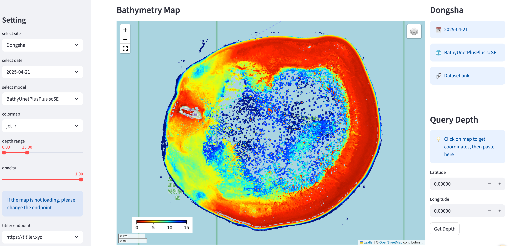

# BathyUNet++

 **PyTorch Implementation** of the paper:
> **BathyUNet++: A Center-Focused Receptive-Field Network for High-resolution Bathymetry Mapping from SuperDove Imagery**

The detail results of this paper are displayed in the interactive app [click](http://165.22.229.35/)

Download all model weights from: https://huggingface.co/datasets/wendian02/BathyUNetPlusPlus-model-weights/tree/main

---

* **[2026-01]**: The paper is submitted. Full source code will be released upon acceptance.

---

